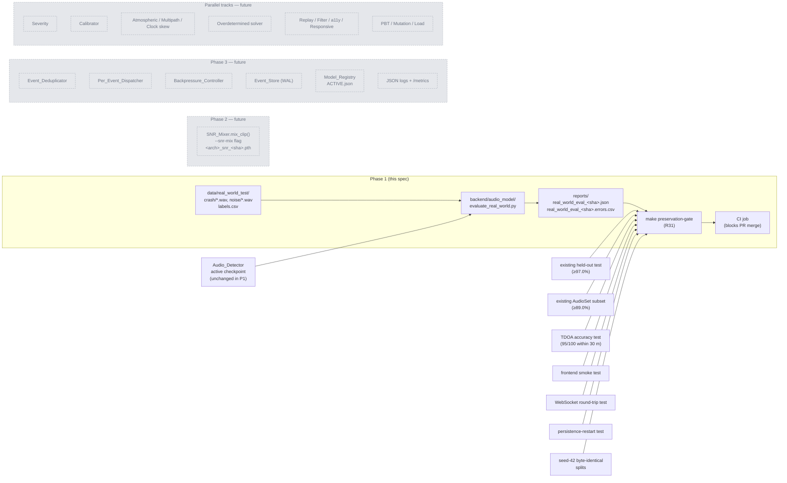

# Design Document — CrashSense Hardening

## Overview

CrashSense Hardening turns the working seed-42 demo (97.31% audio, sub-meter TDOA, WebSocket dashboard) into a system we can defend in the field. This design ships in three phases plus parallel tracks; Phase 1 is the only one fully designed in this document, Phase 2/3/parallel are sketched only enough to keep Phase 1 from painting us into a corner.

### Phase Plan

| Phase | Scope | What ships | Gate to next phase |
| --- | --- | --- | --- |
| **Phase 1 (this design)** | R1 Real-World Test Set + R31 Backward Compatibility | `data/real_world_test/` corpus, `evaluate_real_world.py`, `make preservation-gate` CI job | Baseline number on real audio + green preservation gate on every PR |
| Phase 2 (sketch) | R2 SNR-mixed training | `noise_mixing.mix_clip()`, `--snr-mix` flag, `<arch>_snr_<git_sha>.pth` checkpoints | Phase-1 baseline minus ≤1.0 pp on real-world set |
| Phase 3 (sketch) | R10, R15–R21 production runtime | dedup, per-event dispatcher, backpressure, event store, rate limiter, model registry, structured logs/metrics | Load tests + preservation gate green |
| Parallel (sketch) | R3–R9, R11–R14, R22–R30 | severity, calibration, atmospheric, multipath, clock skew, overdetermined solver, frontend a11y/responsive/replay/filter, mutation tests, load tests, PBT | Each track ships independently behind its own gate |

Design priority: **build the ruler before we measure the wall.** R1 gives us a number to defend, R31 stops the ruler from drifting, everything else is iteration on top.

### Design principles

1. **Deterministic evaluation is non-negotiable.** Two runs of `evaluate_real_world.py` on the same checkpoint must produce identical metric values, otherwise we cannot tell a real regression from numerical drift.
2. **The preservation gate is one job, not seven.** A single `make preservation-gate` command runs every base-spec contract and exits non-zero if any contract slips. CI calls one thing.
3. **Phase 1 must be reversible.** Nothing in Phase 1 changes weights, sensor configs, or live runtime. It only adds files under `data/real_world_test/`, `reports/`, and a single CLI script.
4. **Filenames carry git SHA.** Reports are named `<purpose>_<git_sha>.json` so a CI artifact is self-identifying and we can compare across builds without database lookups.

---

## Architecture



The Phase 1 critical path is one corpus → one script → one report → one gate → CI. Future-phase boxes are shown to make the integration points visible (e.g., the Phase 2 SNR-mixed checkpoint will flow into the same `evaluate_real_world.py` and the same preservation gate, no new wiring required).

---

## Components and Interfaces

### 3.1 Phase 1 — Full Detail

#### 3.1.1 `Real_World_Test_Set` — corpus layout

```
data/real_world_test/
├── crash/                       # ≥100 WAV files, 3.0–30.0 s each
│   ├── rw_crash_0001.wav
│   ├── rw_crash_0002.wav
│   └── ...
├── noise/                       # ≥100 WAV files, 3.0–30.0 s each
│   ├── rw_noise_0001.wav
│   └── ...
└── labels.csv                   # provenance + annotation manifest
```

Validates: R1.1, R1.2, R1.3.

Rules baked into the layout:

- **Disjoint with training corpora.** A pre-commit/CI helper `scripts/check_real_world_disjoint.py` (introduced in §3.1.4 below as part of the gate) computes the set of `filename`s and `source_uri`s in `labels.csv` and asserts zero intersection with `data/raw_audio/` filenames and the training-set source-URI manifest at `data/raw_audio/_manifest.json` (created by extending `dataset_prep.py`'s logging output — non-breaking).
- **Naming convention.** Files use `rw_<class>_<4-digit-id>.wav`. The numeric id is allocated at annotation time, not at ingest time, so re-running the loader does not change ids.
- **Format invariant.** All clips are mono PCM, 22050 Hz, 16-bit (matching `backend/audio_model/spectrogram_gen.SAMPLE_RATE`). The loader validates this and rejects mismatches via the error-CSV path defined in R1.6.

#### 3.1.2 `labels.csv` schema

CSV with header. Validates R1.2.

| Column | Type | Constraint |
| --- | --- | --- |
| `filename` | string | Relative to `data/real_world_test/<label>/`, no leading slash, must end in `.wav` |
| `label` | string | Exactly one of `crash`, `noise` |
| `annotator_id` | string | 1–32 chars, regex `^[A-Za-z0-9_-]+$` |
| `annotated_at_iso8601` | string | ISO 8601 UTC, e.g. `2025-01-15T14:30:00Z` |
| `source_uri` | string | URI of the original recording (URL, S3 key, or local-archive path); must be unique within the file |

The CSV is parsed with Python's stdlib `csv.DictReader` and validated row-by-row through a Pydantic v2 model `RealWorldLabelRow` (defined in §4.2). Validation failures are not fatal — they go to the errors CSV per R1.6.

#### 3.1.3 `evaluate_real_world.py` — CLI and JSON report

Path: `backend/audio_model/evaluate_real_world.py`. Validates R1.4, R1.5, R1.6.

**CLI surface:**

```text
usage: evaluate_real_world.py [-h]
                              [--checkpoint PATH]
                              [--root PATH]
                              [--labels PATH]
                              [--out PATH]
                              [--errors PATH]
                              [--git-sha SHA]
                              [--seed N]

Evaluate the active Audio_Detector checkpoint on the Real_World_Test_Set.

optional arguments:
  --checkpoint PATH   Audio_Detector checkpoint (default: backend/audio_model/crash_detector.pth)
  --root PATH         Corpus root (default: data/real_world_test/)
  --labels PATH       Label manifest (default: <root>/labels.csv)
  --out PATH          Report output (default: reports/real_world_eval_<git_sha>.json)
  --errors PATH       Errors CSV (default: reports/real_world_eval_<git_sha>.errors.csv)
  --git-sha SHA       Override git SHA in output filename (default: from `git rev-parse --short HEAD`)
  --seed N            RNG seed for any tie-breaking (default: 42)

exit codes:
  0  report written successfully
  1  fatal error before evaluation could begin (missing labels.csv, unloadable checkpoint)
  2  evaluation completed but >50% of clips were excluded (signals corpus rot)
```

**Determinism contract (R1.5).** The script:

1. Sorts the validated label rows by `(label, filename)` before iterating.
2. Calls `torch.use_deterministic_algorithms(True)`, sets `torch.manual_seed(args.seed)`, `numpy.random.seed(args.seed)`, and pins `os.environ["PYTHONHASHSEED"]` if not already set.
3. Runs the model in `eval()` mode with `torch.no_grad()` and `batch_size=1` (no shuffling, no DataLoader workers).
4. Computes `accuracy`, `precision`, `recall`, `f1`, `roc_auc`, `confusion_matrix` from a fixed-order list of `(true_label, predicted_label, predicted_score)` triples using sklearn's deterministic implementations.
5. Writes the JSON with `json.dumps(report, indent=2, sort_keys=True)` so byte-identical content also produces byte-identical files.

The five fields named in R1.5 (`accuracy`, `precision`, `recall`, `f1`, `confusion_matrix`) are deterministic by construction. `roc_auc` is also deterministic given the fixed ordering. Only `evaluated_at_iso8601` and `checkpoint_id` (if it depends on file mtime) are allowed to vary across runs; both are excluded from the determinism contract.

**Report JSON shape (R1.4):**

```json
{
  "schema_version": "1.0.0",
  "evaluated_at_iso8601": "2025-01-15T14:30:00Z",
  "git_sha": "abc1234",
  "checkpoint_id": "resnet18_v3_audioset_acc9410.pth",
  "checkpoint_sha256": "9e1f...",
  "n_clips": 213,
  "n_clips_excluded": 4,
  "accuracy": 0.9342,
  "precision": 0.9512,
  "recall": 0.9183,
  "f1": 0.9344,
  "roc_auc": 0.9723,
  "confusion_matrix": [[97, 3], [11, 102]],
  "per_class": {
    "crash": {"precision": 0.95, "recall": 0.91, "f1": 0.93, "support": 113},
    "noise": {"precision": 0.92, "recall": 0.96, "f1": 0.94, "support": 100}
  }
}
```

Top-level required fields (per R1.4): `accuracy`, `precision`, `recall`, `f1`, `roc_auc`, `confusion_matrix`, `n_clips`, `checkpoint_id`, `evaluated_at_iso8601`. Additional fields (`schema_version`, `git_sha`, `checkpoint_sha256`, `n_clips_excluded`, `per_class`) are non-breaking extensions.

**Errors CSV shape (R1.6):**

| Column | Example |
| --- | --- |
| `filename` | `rw_crash_0042.wav` |
| `label` | `crash` |
| `reason` | `missing_on_disk` \| `non_wav_extension` \| `duration_out_of_range` \| `decode_error` \| `csv_validation_error` |
| `detail` | Free-form message: `expected 3.0–30.0s, got 1.7s` |
| `excluded_at_iso8601` | `2025-01-15T14:30:00Z` |

The errors CSV is written incrementally during evaluation so a crash mid-run still leaves a partial diagnostic trail.

#### 3.1.4 Preservation gate — `make preservation-gate`

Validates R31.

This is the single CI-blocking job. It is implemented as a Make target that calls existing test entry points; no test logic is rewritten.

```make
.PHONY: preservation-gate
preservation-gate:
	@echo "==> R31.1 TDOA accuracy gate (3-sensor, 95/100 within 30m, σ=2ms)"
	pytest tests/test_tdoa_solver.py::test_noise_budget_gate -q --no-header
	@echo "==> R31.2 Frontend smoke test"
	cd frontend && npm test -- --run --reporter=dot src/__tests__/smoke.test.jsx
	@echo "==> R31.2 WebSocket round-trip test"
	pytest tests/test_ws_manager.py::test_round_trip -q --no-header
	@echo "==> R31.2 Persistence-restart test"
	pytest tests/test_event_store.py::test_survives_restart -q --no-header
	@echo "==> R31.3 Audio held-out accuracy ≥ 97.0%"
	python -m backend.audio_model.evaluate \
		--json reports/heldout_$$(git rev-parse --short HEAD).json
	python scripts/assert_metric.py \
		reports/heldout_$$(git rev-parse --short HEAD).json \
		--field metrics.accuracy --min 0.970
	@echo "==> R31.3 AudioSet subset accuracy ≥ 89.0%"
	python scripts/assert_metric.py \
		reports/heldout_$$(git rev-parse --short HEAD).json \
		--field per_source.audioset.accuracy --min 0.890
	@echo "==> R31.4 Seed-42 byte-identical splits"
	python scripts/check_seed42_reproducibility.py
	@echo "==> Phase 1 baseline must exist (R1)"
	test -f reports/real_world_eval_$$(git rev-parse --short HEAD).json
	@echo "==> Real-world corpus disjoint with training corpora"
	python scripts/check_real_world_disjoint.py
	@echo "PRESERVATION GATE: all checks passed"
```

**Block-on-failure semantics (R31.5).** The gate exits non-zero on the first failing check (Make's default). In CI, this corresponds to `required-status-checks: ["preservation-gate"]` on the `main` branch protection rule. A red gate blocks merge and blocks promotion of any candidate checkpoint to `ACTIVE.json` (Phase 3) — promotion scripts will read the same gate.

**Two new helper scripts** (small, no business logic):

- `scripts/assert_metric.py` — reads a JSON report, walks a dotted path, exits non-zero if `value < min`. Pure stdlib.
- `scripts/check_seed42_reproducibility.py` — runs `dataset_prep.py` twice with `--dry-run` (a flag we add — non-breaking — that emits the planned split as JSON without copying files), diffs the two outputs byte-for-byte, exits non-zero on mismatch.
- `scripts/check_real_world_disjoint.py` — set-intersection check between `data/real_world_test/labels.csv` and the training manifest; documented in §3.1.1.

**Held-out accuracy gate.** The existing `backend/audio_model/evaluate.py` already produces a JSON with `metrics.accuracy` and `per_source.audioset.accuracy` (verified in the codebase). We reuse it verbatim — no new evaluation code, just an `assert_metric.py` wrapper.

### 3.2 Phase 2 Sketch — `SNR_Mixer`

For R2; **not designed in detail here.**

```python
# backend/audio_model/noise_mixing.py
def mix_clip(
    clean_signal: np.ndarray,        # mono float32, sample-rate independent
    noise_signal: np.ndarray,        # mono float32, looped/cropped to len(clean_signal)
    target_snr_db: float,            # ±0.5 dB tolerance per R2.2
) -> np.ndarray: ...
```

Trainer flag: `python -m backend.audio_model.train --snr-mix`. Per-sample mix probability 0.5; SNR drawn uniformly from `{0, 10, 20}` dB (R2.3). Checkpoint naming convention: `backend/audio_model/checkpoints/<arch>_snr_<git_sha>.pth` (R2.6) — the existing checkpoints directory already follows the `<arch>_v<n>_<tag>.pth` pattern, so SNR checkpoints add a parallel namespace without colliding. The existing `mix_with_highway_noise()` and `mix_at_snr()` in this file (already in the repo) become internal helpers; `mix_clip()` is the new public surface.

### 3.3 Phase 3 Sketch — Production Runtime

For R15–R21; **not designed in detail here.** Sketch focuses on `event_id` flow and the model-registry hot-swap protocol because both have ordering hazards Phase 1 must not foreclose.

#### `event_id` flow

```
audio window → Audio_Detector.predict()
            → assigns Correlation_ID (UUID v4, R21.2)
            → consensus / onset trigger
            → constructs CrashEvent with event_id = Correlation_ID
            → POST /detect-audio (or internal call)
                → Event_Deduplicator (R15) keyed on event_id
                    → if seen: return {deduplicated: true}, no broadcast
                    → if new: persist to dedup store + Event_Store (R18)
                → Per_Event_Dispatcher (R16) keyed on event_id
                    → allocates dedicated drone slot
                    → maintains map[event_id] → DispatchState
                → Backpressure_Controller (R17)
                    → per-client outbound queue, drop-oldest when full
                → WebSocket broadcast to all clients
            → metrics: crash_events_total{outcome="broadcast"|"deduplicated"} (R21.3)
```

`event_id` is the universal correlation key. It is generated at the audio detector (not at the API edge) so dedup works even if the same detection is POSTed twice by retry logic.

#### Model_Registry `ACTIVE.json` swap protocol (R20.4)

`ACTIVE.json` is read by a watcher thread on a 30 s poll. The Audio_Detector keeps **two** loaded checkpoints in memory (primary + secondary) plus a `ChannelTransition` record `(primary_id, secondary_id, ab_split_percent, swap_started_at)`. Per-prediction routing reads the transition record under a `RWLock` (read-side); the watcher writes it under the write-side. In-flight predictions complete on whichever checkpoint they were dispatched to (each `predict()` captures the routing decision at start of the call), so a swap mid-prediction does not drop or corrupt that prediction. The previous primary is held in memory for `swap_drain_seconds` (default 30) before being released — this is the "no in-flight predictions dropped" guarantee in R20.4.

### 3.4 Parallel Tracks Sketch

One paragraph each.

**Severity grading (R3).** `backend/audio_model/severity.py` already exists in the repo as a stub; it gets a `grade(audio)` function and a head trained on a severity-labeled subset of the Real_World_Test_Set. Macro F1 ≥ 0.60 gate. Severity is appended to the `CrashEvent` schema as a required field with default `"moderate"` and confidence `0.0` on classifier failure (R3.4) — this is the safe-fallback path so Phase 3 dispatch keeps working.

**Spatial audio decision doc (R4).** Pure documentation deliverable: `docs/spatial_audio_decision.md` with `Hypothesis / Setup / Results / Decision`. Default recommendation is **defer** unless multi-channel sensor hardware is confirmed for production — the lift on a single-channel dashcam corpus is theoretically zero.

**Calibration round-trip (R5).** Temperature scaling (1 parameter) and isotonic regression (piecewise-linear breakpoints), serialized to a plain-text JSON keyed by method. The R5.6 round-trip property (`decode(encode(C)).transform(x) ≈ C.transform(x)` within 1e-6) is straightforward for both methods — temperature scaling is trivially round-trippable; isotonic regression's breakpoints serialize as a sorted list of `(x, y)` pairs.

**Atmospheric correction (R11).** `backend/triangulation/atmospheric.py` with `effective_speed_of_sound(T, RH, wind_vec, prop_vec)`. The repo already has `speed_of_sound_at(T, RH)` in `sensor_config.py` — that becomes the temperature/humidity baseline; the atmospheric module adds the wind-projection term `c_eff = c_still + dot(wind_vec, prop_vec)`. Temperature monotonicity (R11.3) and wind sign-correctness (R11.4) are direct consequences of the formula.

**Multipath rejection (R12).** Residual-L2-norm filter on candidate solutions returned by the optimizer. Threshold `multipath_residual_threshold_s` defaults to 5 ms (the order of magnitude of one sample at 22050 Hz over a typical 100 m baseline). Reflected-path simulation injects a delayed copy at 5–50 ms; the filter must reject the phantom in ≥90/100 trials.

**Clock skew (R13).** Per-sensor offset estimator from NTP/PTP samples. The skew bound (R13.4) is derived as `2 * stdev(samples)` so it dominates the noise. `tdoa_localize` subtracts `offset_us` before computing residuals; if any sensor's bound exceeds its `SensorRecord.clock_offset_us_bound`, the solver fails fast with `clock_skew_exceeded`.

**Overdetermined solver (R14).** Existing `tdoa_solver.py` extended from 3-sensor closed form to N-sensor least-squares. Permutation symmetry (R14.5) follows from least-squares being permutation-invariant on the residual sum. Single-sensor failure tolerance (R14.2) is implemented by dropping any sensor whose arrival time has not been received within `sensor_timeout_ms`, then re-checking that ≥3 sensors remain.

**Frontend Mapbox flag (R22).** `VITE_MAP_PROVIDER` build-time env var, default `"leaflet"`. Mapbox dependencies move to `optionalDependencies` so a clean `npm install` does not pull them. Both code paths share a `<MapAdapter>` component interface.

**Replay (R23).** `ReplayController.jsx` fetches `GET /events/{event_id}` and re-runs `<DroneTracker>` animation in a "replay" mode that suppresses any WebSocket broadcast on completion. Live events during a replay render concurrently — the replay layer is a separate React tree branch.

**Alert filter (R24).** Local-only filter/sort over the already-fetched event list. No backend changes. Re-renders within 100 ms because filtering ≤ a few hundred cards is microsecond-scale.

**Accessibility (R25).** Automated `axe-core` test in CI must show zero serious/critical violations on every primary route. `prefers-reduced-motion` short-circuits drone animations to a 200 ms cross-fade. Manual items (screen reader walkthrough, expert WCAG audit) tracked as open work in `docs/accessibility_audit.md` — full WCAG 2.1 AA conformance requires manual testing with assistive technologies and an accessibility expert review and is not claimed by this design.

**Responsive layouts (R26).** Visual-regression snapshots at 375/768/1024/1440 px. Layout breakpoints baked into Tailwind config: `<768px` mobile drawer, `768–1023px` 70/30 split, `≥1024px` 80/20 split. 44 px hit targets enforced by a Tailwind plugin rule on touch viewports.

**Unit tests (R27).** Vitest under `frontend/src/__tests__/`. Coverage target 70% line / 60% branch via `c8`. All `fetch` and `WebSocket` interactions mocked.

**Load tests (R28).** Two scripts under `tests/load/` invoked by `make load-test`. Outputs JSON summaries to `reports/load_*.json` for trend analysis.

**Mutation tests (R29).** `mutmut` for Python (TDOA, atmospheric, dedup, rate limiter, onset), `Stryker` for JS (AlertPanel, DroneTracker, useWebSocket). Thresholds 70% Py / 60% JS. Run by `make mutation-test`.

**PBT (R30).** Hypothesis (Python) + fast-check (JS) under `make pbt`. Full property catalog in §7 of this document.

---

## Data Models

### 4.1 `SensorDeployment` and `SensorRecord` (Phase 3 foreshadowing)

Defined here because Phase 1's preservation gate (R31.1) tests TDOA on the 3-sensor minimal deployment, and that deployment will eventually be expressed in this schema. We introduce the Pydantic models in Phase 1 as **read-only**; nothing in Phase 1 writes them.

```python
# backend/triangulation/schema.py
from pydantic import BaseModel, Field, field_validator
from typing import Literal

class SensorRecord(BaseModel):
    sensor_id: str = Field(min_length=1, max_length=32, pattern=r"^[A-Za-z0-9_-]+$")
    display_name: str = Field(min_length=1, max_length=64)
    lat: float = Field(ge=-90.0, le=90.0)
    lon: float = Field(ge=-180.0, le=180.0)
    altitude_m: float = Field(ge=-500.0, le=5000.0)
    is_toll_plaza: bool
    clock_source: Literal["NTP", "PTP", "GPS", "NONE"]
    clock_offset_us_bound: float = Field(ge=0.0, le=1_000_000.0)
    microphone_model: str = Field(min_length=1, max_length=64)

class SensorDeployment(BaseModel):
    schema_version: str  # semver, validated downstream
    mode: Literal["demo", "production"]
    sensors: list[SensorRecord] = Field(min_length=3, max_length=16)
    metadata: dict  # name, created_at_iso8601, notes

    @field_validator("sensors")
    @classmethod
    def production_requires_synced_clocks(cls, v, info):
        # R10.5: production mode forbids clock_source == "NONE"
        if info.data.get("mode") == "production":
            if any(s.clock_source == "NONE" for s in v):
                raise ValueError("production mode requires synchronized clocks on every sensor")
        return v
```

The bundled demo deployment lives at `backend/triangulation/deployments/demo_3sensor.yaml` and is generated from the existing `MINIMAL` tuple in `sensor_config.py` — this preserves R31.1 (3-sensor TDOA accuracy gate uses the same coordinates).

### 4.2 Real-world label CSV — Pydantic schema

```python
# backend/audio_model/real_world_schema.py
from pydantic import BaseModel, Field
from datetime import datetime
from typing import Literal

class RealWorldLabelRow(BaseModel):
    filename: str = Field(pattern=r"^[A-Za-z0-9_\-]+\.wav$")
    label: Literal["crash", "noise"]
    annotator_id: str = Field(min_length=1, max_length=32, pattern=r"^[A-Za-z0-9_-]+$")
    annotated_at_iso8601: datetime  # Pydantic parses ISO 8601 automatically
    source_uri: str = Field(min_length=1)
```

Validates R1.2. Uniqueness of `source_uri` is enforced at the manifest level (after parsing all rows) rather than at the row level.

### 4.3 Evaluation report — JSON schema

A JSON Schema document at `schemas/real_world_eval.schema.json`:

```json
{
  "$schema": "https://json-schema.org/draft/2020-12/schema",
  "title": "RealWorldEvalReport",
  "type": "object",
  "required": [
    "schema_version", "evaluated_at_iso8601", "checkpoint_id",
    "n_clips", "accuracy", "precision", "recall", "f1",
    "roc_auc", "confusion_matrix"
  ],
  "properties": {
    "schema_version": {"type": "string", "pattern": "^\\d+\\.\\d+\\.\\d+$"},
    "evaluated_at_iso8601": {"type": "string", "format": "date-time"},
    "git_sha": {"type": "string", "pattern": "^[0-9a-f]{7,40}$"},
    "checkpoint_id": {"type": "string"},
    "checkpoint_sha256": {"type": "string", "pattern": "^[0-9a-f]{64}$"},
    "n_clips": {"type": "integer", "minimum": 0},
    "n_clips_excluded": {"type": "integer", "minimum": 0},
    "accuracy": {"type": "number", "minimum": 0.0, "maximum": 1.0},
    "precision": {"type": "number", "minimum": 0.0, "maximum": 1.0},
    "recall": {"type": "number", "minimum": 0.0, "maximum": 1.0},
    "f1": {"type": "number", "minimum": 0.0, "maximum": 1.0},
    "roc_auc": {"type": "number", "minimum": 0.0, "maximum": 1.0},
    "confusion_matrix": {
      "type": "array",
      "items": {"type": "array", "items": {"type": "integer", "minimum": 0}}
    }
  }
}
```

### 4.4 `CrashEvent.severity` — sketch only

To be added in the parallel severity track (R3). Schema delta:

```python
class CrashEvent(BaseModel):
    # ... existing fields preserved ...
    severity: Literal["minor", "moderate", "severe"]
    severity_confidence: float = Field(ge=0.0, le=1.0)
```

Not implemented in Phase 1; listed here so the field name is reserved.

---

## Error Handling

### 5.1 Phase 1 — `evaluate_real_world.py` failure modes

Driven by R1.6.

| Condition | Detection | Handling | Recorded as |
| --- | --- | --- | --- |
| File listed in `labels.csv` not on disk | `Path.exists()` check before decode | Skip clip, append to errors CSV, continue | `reason=missing_on_disk` |
| File exists but not `.wav` extension | Filename regex check | Skip clip, append, continue | `reason=non_wav_extension` |
| Decoded duration `< 3.0` or `> 30.0` s | `soundfile.info()` returns frames + sample rate | Skip clip, append, continue | `reason=duration_out_of_range`, `detail` carries actual seconds |
| WAV decode raises | `soundfile.read()` exception | Catch, skip, append, continue | `reason=decode_error`, `detail` carries exception class |
| CSV row fails Pydantic validation | `RealWorldLabelRow(**row)` raises `ValidationError` | Skip row, append, continue | `reason=csv_validation_error`, `detail` carries first error message |
| `>50%` of rows excluded | Tracked counter | Exit code 2 after writing report (signals corpus rot) | (also emitted to stderr) |
| `labels.csv` missing entirely | Pre-flight check | Exit code 1 immediately, no output files | (stderr only) |
| Checkpoint file missing or unloadable | `torch.load` raises before evaluation | Exit code 1 immediately | (stderr only) |

Critical invariant: **a single bad clip never aborts the run.** Every per-clip failure is non-fatal. This is a property test — see §6.1.

### 5.2 Preservation gate — failure modes

Driven by R31.5.

| Sub-check | Failure signature | Diagnostic artifact |
| --- | --- | --- |
| TDOA noise budget | `pytest` non-zero | `pytest` last-failed cache, plus stderr from the deterministic Hypothesis seed |
| Frontend smoke / WS round-trip / persistence-restart | `pytest` / `vitest` non-zero | Per-test log captured by the CI runner |
| Held-out ≥97.0% | `assert_metric.py` non-zero | `reports/heldout_<sha>.json` with the actual number |
| AudioSet ≥89.0% | Same | Same file, `per_source.audioset.accuracy` |
| Seed-42 reproducibility | `check_seed42_reproducibility.py` non-zero | Diff of the two `--dry-run` JSON outputs printed to stderr |
| Phase-1 baseline missing | `test -f` non-zero | Printed message: "Run `make eval-real-world` before opening this PR" |
| Disjointness check | `check_real_world_disjoint.py` non-zero | List of overlapping filenames + source URIs |

The gate fails **fast** on the first red sub-check (Make's default behavior). This is intentional: a TDOA regression and an accuracy regression want different fix paths and the CI log should make the first cause obvious.

**Promotion blocking (R31.5).** Any script that updates `ACTIVE.json` (Phase 3 model registry) calls `make preservation-gate` first and refuses to write on non-zero exit. Phase 1 has no such promotion script yet, so this is enforced purely at the CI / branch-protection level.

---

## Testing Strategy

### 6.1 Phase 1 — full detail

**Unit tests (new):**

- `tests/test_evaluate_real_world.py::test_excludes_missing_clip` — manifest references a file that does not exist; assert it appears in errors CSV with `reason=missing_on_disk` and is absent from the report's `n_clips` count.
- `tests/test_evaluate_real_world.py::test_excludes_short_clip` — manifest references a 1.5 s WAV; assert `reason=duration_out_of_range`.
- `tests/test_evaluate_real_world.py::test_excludes_long_clip` — manifest references a 31 s WAV; same.
- `tests/test_evaluate_real_world.py::test_excludes_non_wav` — manifest entry with `.mp3` extension; `reason=non_wav_extension`.
- `tests/test_evaluate_real_world.py::test_csv_round_trip` — write a `RealWorldLabelRow` set, read it back, assert field-wise equality (R30.12-style round trip).
- `tests/test_evaluate_real_world.py::test_report_matches_schema` — generated report validates against `schemas/real_world_eval.schema.json`.

**Determinism check (R1.5):**

```bash
# Standalone, reproducible by anyone
python -m backend.audio_model.evaluate_real_world --out /tmp/run1.json --git-sha test
python -m backend.audio_model.evaluate_real_world --out /tmp/run2.json --git-sha test
python - <<'PY'
import json
a = json.load(open("/tmp/run1.json"))
b = json.load(open("/tmp/run2.json"))
nondeterministic = {"evaluated_at_iso8601"}
for k in a.keys() | b.keys():
    if k in nondeterministic:
        continue
    assert a[k] == b[k], f"mismatch on {k}: {a[k]} vs {b[k]}"
print("OK")
PY
```

This is also encoded as a CI-only smoke test that runs on a tiny fixture corpus (4 clips total in `tests/fixtures/real_world_test/`) so PRs do not need access to the full ≥200-clip corpus.

**Preservation gate dry run.** Locally: `make preservation-gate`. In CI: same command, with the corpus and checkpoints fetched from S3 by a setup step. Wall-clock budget: ≤10 minutes on the reference hardware.

### 6.2 Future-phase testing — sketch

PBT property catalog in the Correctness Properties section. Mutation testing scope listed in R29. Load tests scoped in R28. Phase-2 testing folds into the same `evaluate_real_world.py` — no new evaluator. Phase-3 testing adds the WS/dispatch/dedup property tests from R30 and the load tests from R28.

---

## Correctness Properties

*A property is a characteristic or behavior that should hold true across all valid executions of a system — a formal statement about what the system should do. Properties bridge human-readable specifications and machine-verifiable correctness guarantees. PBT is appropriate here because most of CrashSense's core algorithms (TDOA solver, atmospheric correction, dedup, rate limiter, calibrator, schema serializers, deterministic evaluator) are pure functions or have universal invariants over a large input space. PBT is **not** used for the dashboard's visual output, the SQLite WAL configuration, or the CI wiring — those use snapshot tests, schema validation, and integration checks respectively.*

This is the full property catalog. Source: R30 plus three Phase-1 properties derived from R1.5, R1.2, and R31.4. After Property Reflection we land at 16 properties: the requirements list 13, we add P13/P14/P16 for Phase-1 determinism, CSV round-trip, and seed-42 reproducibility, and we merge R30.3 with R14.5 into a single P2 covering all N. Each property is implemented as one Hypothesis (Python) or fast-check (JS) test, configured for ≥100 iterations per R30 and tagged `# Feature: crashsense-hardening, Property P<n>: <text>`.

### Property 1: TDOA solver noise-budget

*For any* sensor configuration with 3 to 16 sensors and any crash coordinate strictly inside the convex hull of the sensors, perturbing arrival times with independent Gaussian noise of standard deviation in [0.0, 0.005] s produces a localization error less than or equal to the noise-budget bound documented in `docs/tdoa_error_bound.md`.

**Validates: Requirements 30.2, 31.1**

### Property 2: TDOA permutation symmetry (all N)

*For any* N in [3, 16] and any permutation π applied to both the sensor list and the arrival times, the returned `(lat, lon)` matches the unpermuted result within 1e-6 degrees. Covers both the 3-sensor and overdetermined N≥4 cases — R30.3 and R14.5 are the same property at different N and are merged here per the prework reflection.

**Validates: Requirements 30.3, 14.5**

### Property 3: Event dedup idempotency

*For any* sequence of N submissions with the same `event_id`, the count of broadcast messages with that `event_id` equals exactly 1.

**Validates: Requirements 30.4, 15.4**

### Property 4: Event-id non-duplication broadcast

*For any* interleaving of M distinct `event_id` submissions, no `event_id` appears in the broadcast log more than once.

**Validates: Requirements 30.5**

### Property 5: Onset detector refractory monotonicity

*For any* input audio stream S and any two refractory values r1 < r2, the count of emitted CRASH predictions on S with refractory r1 is greater than or equal to the count with refractory r2.

**Validates: Requirements 30.6, 8.5**

### Property 6: Atmospheric temperature monotonicity

*For any* humidity and wind vector held fixed, increasing `temperature_c` strictly increases the returned effective speed of sound.

**Validates: Requirements 30.7, 11.3**

### Property 7: Atmospheric wind sign-correctness

*For any* wind vector and propagation unit vector, when `dot(wind, prop) > 0` the returned effective speed is greater than the still-air speed at the same temperature and humidity, and when the dot product is negative, the returned effective speed is less than the still-air speed.

**Validates: Requirements 30.8, 11.4**

### Property 8: Dispatch slot-exclusivity

*For any* sequence of `CrashEvent` submissions and dispatch transitions, at any instant no two active dispatches share the same drone slot identifier.

**Validates: Requirements 30.9, 16.4**

### Property 9: Rate limiter budget-bound

*For any* sequence of requests from a single client across any rolling 60-second window on a rate-limited route, the count of accepted requests is less than or equal to `rate_limit_burst + rate_limit_sustained_per_minute`.

**Validates: Requirements 30.10, 19.3**

### Property 10: Backpressure fast-client-non-stalling

*For any* mix of fast and slow WebSocket clients, the wall-clock delivery latency to a fast client is bounded by the broadcast cost plus the fast client's own send time, independent of any slow client's behavior.

**Validates: Requirements 30.11, 17.5**

### Property 11: SensorDeployment round-trip

*For any* valid `SensorDeployment` instance D, `parse(dump(D))` produces an instance equal to D under field-wise comparison, in both YAML and JSON serializations.

**Validates: Requirements 30.12, 10.4**

### Property 12: Calibrator round-trip

*For any* fitted calibrator C and any input logit vector x, `decode(encode(C)).transform(x)` produces values within 1e-6 of `C.transform(x)`, where `encode` and `decode` are the JSON serializer and parser.

**Validates: Requirements 30.13, 5.6**

### Property 13: evaluate_real_world.py determinism

*For any* (checkpoint, real-world corpus) pair, two successive invocations of `backend/audio_model/evaluate_real_world.py` on the same host produce reports whose `accuracy`, `precision`, `recall`, `f1`, and `confusion_matrix` fields are identical. This is the Phase-1 determinism property.

**Validates: Requirements 1.5**

### Property 14: RealWorldLabelRow CSV round-trip

*For any* list of valid `RealWorldLabelRow` instances, serializing the list to CSV and parsing it back produces a list whose rows are field-wise equal to the original. This validates that label provenance is not corrupted by the manifest serializer.

**Validates: Requirements 1.2**

### Property 15: Clock skew bound

*For any* sequence of NTP/PTP samples perturbed by zero-mean Gaussian noise with standard deviation σ_us less than 100, the returned `offset_us_bound` is greater than or equal to `2 · σ_us`.

**Validates: Requirements 13.4**

### Property 16: Seed-42 dataset-split byte-identical

*For any* state of the source archive, two invocations of `dataset_prep.py --dry-run` with `SEED = 42` produce byte-identical split JSON. This is the Phase-1 reproducibility property that the preservation gate enforces.

**Validates: Requirements 31.4**

---

## Open Questions / Deferred Decisions

### 8.1 Where does the real dashcam audio come from?

**Question.** R1 requires ≥100 crash + ≥100 non-crash dashcam clips, disjoint with training. The training set already pulls from AudioSet, ESC-50, UrbanSound8K, and Freesound (verified in `dataset_prep.py`). Do we need to record our own dashcam audio, or can we source from existing public corpora?

**Recommendation: a hybrid, weighted toward public corpora, in this order:**

1. **YouTube creator-licensed dashcam channels (primary).** Specific channels (e.g., "Wreckage Aftermath", "DashCam Lessons", "Road Cams India") publish dashcam compilations under standard YouTube licenses. We pull a sample, hand-cut 3–30 s windows around each event, and record the source URL in `source_uri`. Disjointness with AudioSet is straightforward — AudioSet uses YouTube `video_id`s as keys, so we deduplicate by `video_id` before annotating. **Estimated effort: 2 engineer-weeks for 100 crash + 100 noise.**
2. **Existing crash datasets with permissive licensing (secondary).** The CADP (CCTV Crash Accident Database) and a few research datasets (e.g., "Car Crash Dataset" / CCD on GitHub) ship video; we extract audio and label. License terms vary — must be reviewed clip-by-clip.
3. **In-house recording (tertiary, only if 1+2 are insufficient).** Mount a dashcam in a partner vehicle for ~3 months. **Estimated effort: 3 engineer-months calendar time, ≤1 engineer-week labor.** This is the only path that yields severity labels on real impacts (R3.5 needs them).

**Why this ordering:** option 1 gets us a defensible Phase 1 baseline in weeks, not months. Options 2–3 augment it without blocking. Severity labels (R3.5) are the single strongest reason to also do option 3 eventually, but Phase 1 does not require severity, so we can defer.

**Decision needed before Phase 1 implementation begins.** The corpus license posture and the disjointness-check policy depend on this.

### 8.2 Smaller open questions

- **Reference hardware.** R9.2, R28.4 mention `docs/perf_baseline.md`. We have not chosen the SKU. Recommendation: a single-NVIDIA-T4 cloud instance (e.g., `g4dn.xlarge`) — cheap, reproducible, matches edge-deployment thermal envelope.
- **`schema_version` semver semantics.** Do we bump on additive changes? Recommendation: yes (minor bump on add, major bump on remove/rename), with a backward-compat parser shim for one major version.
- **Errors-CSV exit code.** R1.6 says "continue processing", but does a >50% exclusion rate signal a corrupt corpus we should fail on? Current design (§3.1.3) returns exit code 2 in that case; flagging for review.
- **Determinism on GPU.** `torch.use_deterministic_algorithms(True)` may degrade throughput. For Phase 1 evaluation this is acceptable (one-shot run). For training (Phase 2), determinism may need to be relaxed to `cudnn.deterministic = True` only.

These are tracked but not blocking — Phase 1 can begin once §8.1 is resolved.
